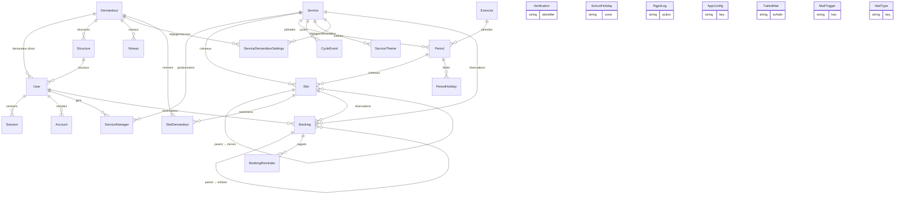

# Base de données — CultuRésa (structure & dictionnaire)

Descriptif de la base **PostgreSQL** : diagramme des relations (ERD) + dictionnaire de données.

> **Source de vérité** : ce document est dérivé de [`prisma/schema.prisma`](../prisma/schema.prisma).
> La base est **générée** à partir de ce schéma (migrations Prisma) — en cas de doute, le schéma
> fait foi. Régénérer une vue à jour : `pnpm prisma studio` (exploration) ou relire le schéma.

## Conventions

- **Modèle ↔ table** : le code manipule un modèle Prisma (singulier, PascalCase, ex. `Structure`) ;
  la table physique est nommée par `@@map` (ex. `structures`). Les deux noms sont donnés ci-dessous.
- **Types** : `texte` = String, `entier` = Int, `smallint` = petit entier, `booléen` = Boolean,
  `horodatage` = timestamp avec fuseau (timestamptz), `date` = date seule, `JSON`, ou un `enum` nommé.
- **Clés** : 🔑 PK · ⊙ unique · ↗ clé étrangère (FK) → table cible.
- **`onDelete`** : `Cascade` = supprimé avec le parent ; `SetNull` = le lien passe à null ; (défaut
  `Restrict` sinon).
- **Identifiants** : `cuid()` (texte) pour l'auth et `Service`/`Slot` (ids applicatifs `svc_…`,
  `u_…`) ; `autoincrement()` (entier) pour les référentiels et réservations.

## Enums

| Enum | Valeurs | Usage |
|---|---|---|
| `Role` | `utilisateur`, `gestionnaire`, `administrateur` | rôle du compte |
| `ThemesMode` | `libre`, `liste` | saisie du thème d'une réservation |
| `SlotType` | `recurring`, `unique` | type de créneau (récurrent / ponctuel ou miroir) |
| `BookingType` | `recurring`, `unique` | type de réservation |
| `EntityState` | `actif`, `desactive`, `archive` | état d'un créneau / d'une période |
| `Pointage` | `present`, `absent` | présence relevée sur une séance |
| `AbsenceSource` | `usager`, `gestionnaire` | auteur d'une absence prévenue à l'avance (`Booking.absencePrevenuePar`) |
| `DayOfWeek` | `lun`…`dim` | jour d'un créneau récurrent (1 slot = 1 jour) |

---

## Diagramme des relations (ERD)

> Rendu : GitHub et VS Code (aperçu `Ctrl+Shift+V`) affichent ce diagramme automatiquement.

---

## Dictionnaire de données

### 1. Authentification (Better Auth)

#### `User` → `user`
Compte (usager / gestionnaire / admin). Champs métier ajoutés via Better Auth.

| Colonne | Type | Null | Défaut | Clé | Description |
|---|---|---|---|---|---|
| id | texte | non | cuid() | 🔑 | identifiant |
| email | texte | non | | ⊙ | e-mail = identifiant de connexion |
| emailVerified | booléen | non | false | | e-mail confirmé |
| name | texte | non | "" | | nom d'affichage (`prenom nom`) |
| image | texte | oui | | | (champ Better Auth, inutilisé) |
| prenom / nom / tel / niveau | texte | non | "" | | champs profil |
| enfants / accompagnants | smallint | non | 0 | | effectifs par défaut |
| role | `Role` | non | utilisateur | | rôle |
| rgpdOk | booléen | non | false | | consentement RGPD |
| onboardedAt | horodatage | oui | | | fin de la modale de bienvenue |
| demandeurId | entier | oui | | ↗ `demandeurs` (SetNull) | demandeur **direct** |
| structureId | entier | oui | | ↗ `structures` (SetNull) | structure de rattachement |
| lastLoginAt | horodatage | oui | | | dernière connexion (inactivité RGPD) |
| anonymizedAt | horodatage | oui | | | compte anonymisé |
| deletionNoticeSentAt | horodatage | oui | | | préavis de suppression envoyé |
| createdAt / updatedAt | horodatage | non | now()/auto | | |

Index : `demandeurId`, `structureId`.

#### `Session` → `session`
| Colonne | Type | Null | Clé | Description |
|---|---|---|---|---|
| id | texte | non | 🔑 | |
| token | texte | non | ⊙ | jeton de session |
| userId | texte | non | ↗ `user` (Cascade) | |
| expiresAt | horodatage | non | | expiration |
| ipAddress / userAgent | texte | oui | | |
| createdAt / updatedAt | horodatage | non | | |

#### `Account` → `account`
Identifiants d'auth (mot de passe hashé, ou provider externe). | id 🔑 ; `userId` ↗ `user` (Cascade) ; `providerId`, `accountId`, `password?` (hash), jetons OAuth optionnels, horodatages.

#### `Verification` → `verification`
Jetons temporaires Better Auth (vérif e-mail, reset). | id 🔑 ; `identifier` (indexé), `value`, `expiresAt`, horodatages. **Sans FK.**

---

### 2. Service & configuration

#### `Service` → `services`
Activité réservable. PK = id applicatif (`svc_00N`).

| Colonne | Type | Défaut | Description |
|---|---|---|---|
| id | texte 🔑 | | `svc_00N` |
| label | texte | | nom |
| validationBloquante | booléen | false | verrouille les réservations validées (annulation/déplacement) |
| position | entier | 0 | ordre d'affichage |
| duration | entier | 60 | durée créneau (min) |
| capacity | entier | 1 | capacité par défaut |
| icon | texte? | | icône |
| showPreviousExercices | booléen | false | afficher les exercices passés |
| semaineAb | booléen | false | alternance A/B activée |
| themesMode | `ThemesMode` | libre | saisie du thème |
| gaugeAccompagnants | booléen | true | compter les accompagnants dans la jauge |
| absencePrevenue | booléen | false | « Absences prévenues » : signalement d'absence à l'avance (usager + gestionnaire), opt-in |
| listeAttente | booléen | false | « Liste d'attente » : disponibilités des usagers, notification / inscription automatique, opt-in |
| autoValidationDelay | entier | 0 | délai d'auto-validation **signé** (0=off, <0=ouvré, >0=calendaire) |
| mgrNoticeMode | texte | none | digest gestionnaires (none/hours/daily/weekly) |
| mgrNoticeIntervalHours / Hour / Weekday | entier/texte | 4 / 8 / lun | cadence du digest |
| mgrNoticeLastSentAt | horodatage? | | dernier digest envoyé |
| createdAt | horodatage | now() | |

#### `ServiceManager` → `service_manager`
Gestionnaires nominatifs d'un service (N-N). PK composite `(userId, serviceId)` ; `userId` ↗ `user` (Cascade), `serviceId` ↗ `services` (Cascade). Index `serviceId`.

#### `Slot` → `slots`
Créneau. **1 slot = 1 jour.** Récurrent (modèle) **ou** unique/miroir (daté).

| Colonne | Type | Défaut | Clé | Description |
|---|---|---|---|---|
| id | texte | | 🔑 | |
| serviceId | texte | | ↗ `services` (Cascade) | |
| slotType | `SlotType` | recurring | | récurrent / unique |
| startTime / endTime | texte | 09:00 / 10:30 | | horaires |
| slotDate | date | | | date (unique/miroir ; null si récurrent) |
| slotDay | `DayOfWeek`? | | | jour (récurrent ; null si unique) |
| capacity | entier? | | | capacité (sinon défaut service) |
| periodId | entier? | | ↗ `periods` (Cascade) | période de rattachement |
| parentSlotId | texte? | | ↗ `slots` (Cascade, self) | créneau parent (pour un miroir) |
| weeks | texte? | | | parité(s) A/B (CSV) |
| jauge | booléen | false | | « a une jauge » — posé à la création (mode jauge de l'agenda), miroirs = parent |
| state | `EntityState` | actif | | |

Index : `serviceId`, `parentSlotId`, `periodId`, `(slotDate, state)`.

#### `Exercice` → `exercice`
Année/cycle de fonctionnement d'un service. Porte les réglages d'ouverture, les
maximums de réservation et le délai limite de réservation (le service ne les porte
plus) ; une date hors de tout exercice est FERMÉE.

| Colonne | Type | Défaut | Clé | Description |
|---|---|---|---|---|
| id | entier | auto | 🔑 | |
| serviceId | texte? | | ↗ `services` (Cascade) | |
| label | texte | | | ex. « 2025-2026 » |
| type | `ExerciceType` | scolaire | | scolaire / civile |
| dateStart / dateEnd | date? | | | bornes |
| morningStart/End, afternoonStart/End | texte | 09:00/12:00/14:00/18:00 | | plages horaires |
| activeDays | texte | "lun,mar,mer,jeu,ven" | | jours ouvrés (CSV) |
| openOnHolidays | booléen | false | | ouvert les jours fériés |
| openOnSchoolHolidays | booléen | false | | ouvert pendant les vacances scolaires |
| visibleToUsers | booléen | false | | « Affiché aux utilisateurs » — UNIQUE exercice du service accessible côté usager |
| maxReservations | entier | 1 | | quota usager sur l'EXERCICE (« par an ») |
| maxReservationsPeriod | entier | 1 | | quota usager par période |
| bookingDelay | entier | 0 | | délai limite de réservation (encodage legacy : <0 jours ouvrés, ≥1000 calendaire) |
| createdAt | horodatage | now() | | |

Relation : `periods`. Index `serviceId`.

#### `Period` → `periods`
Période d'un service (vacances, trimestre…).

| Colonne | Type | Défaut | Clé | Description |
|---|---|---|---|---|
| id | entier | auto | 🔑 | |
| serviceId | texte? | | ↗ `services` (Cascade) | |
| exerciceId | entier? | | ↗ `exercice` (SetNull) | |
| label / etiquette | texte / texte? | | | libellés |
| dateStart / dateEnd | date? | | | bornes |
| color | texte | #6dceaa | | couleur d'affichage |
| position | entier | 0 | | |
| state | `EntityState` | actif | | |

Index : `serviceId`, `exerciceId`.

#### `CycleEvent` → `cycle_events`
Journal des bascules de cycle (pour annulation). | id 🔑 ; `serviceId?` ↗ `services` (Cascade) ; `data` JSON ; `createdAt`. Index `(serviceId, createdAt)`.

#### `PeriodHoliday` → `period_holidays`
Jours fériés matérialisés d'une période. | id 🔑 ; `periodId` ↗ `periods` (Cascade) ; `date`, `label`. **Unique `(periodId, date)`.**

#### `SchoolHoliday` → `school_holidays`
Plages de vacances scolaires par zone. | id 🔑 ; `zone` (1 car.), `dateStart`, `dateEnd`, `label`. Index `(zone, dateStart, dateEnd)`. **Sans FK.**

---

### 3. Référentiels (rattachement & accès)

#### `Demandeur` → `demandeurs`
Catégorie de demandeur. | id 🔑 (auto) ; `label` ; `openOnSchoolHolidays` (défaut **true**). Relations : structures, niveaux, restrictions de créneaux, réglages par service, usagers.

#### `Structure` → `structures`
Établissement rattaché à un demandeur. | id 🔑 ; `demandeurId` ↗ `demandeurs` (**Cascade**, obligatoire) ; `label`. Index `demandeurId`.

#### `Niveau` → `niveaux`
Niveau scolaire (liste de choix). | id 🔑 ; `label` ; `demandeurId?` ↗ `demandeurs` (SetNull) ; `position`. Index `demandeurId`. *(Pas de FK depuis `user.niveau`, qui est un texte libre.)*

#### `SlotDemandeur` → `slot_demandeurs`
Restriction d'un créneau à certains demandeurs (liste vide = pas de restriction). PK composite `(slotId, demandeurId)` ; `slotId` ↗ `slots` (Cascade), `demandeurId` ↗ `demandeurs` (Cascade). Index `demandeurId`.

#### `ServiceTheme` → `service_themes`
Thèmes prédéfinis d'un service (mode `liste`). | id 🔑 ; `serviceId` ↗ `services` (Cascade) ; `label`, `position`. Index `serviceId`.

#### `ServiceDemandeurSettings` → `service_demandeur_settings`
**Matrice service × demandeur** : définit l'accès **et** les modes. PK composite `(serviceId, demandeurId)`.

| Colonne | Type | Défaut | Description |
|---|---|---|---|
| serviceId | texte | | ↗ `services` (Cascade) |
| demandeurId | entier | | ↗ `demandeurs` (Cascade) |
| recurrent | booléen | false | mode récurrent autorisé |
| semaineAb | booléen | false | alternance A/B |
| validation | booléen | false | validation requise |
| themes | booléen | false | thèmes activés |

> (La jauge est portée par CHAQUE CRÉNEAU — `slots.jauge` — plus par la matrice.)

> La **présence** d'une ligne = le demandeur a accès au service. Index `demandeurId`.

---

### 4. Réservations

#### `Booking` → `bookings`
Réservation. Une **récurrente** (parente) génère des **enfants** datés (un par occurrence, `bookingType=unique`, `parentBookingId` renseigné).

| Colonne | Type | Défaut | Clé | Description |
|---|---|---|---|---|
| id | entier | auto | 🔑 | |
| bookingType | `BookingType` | recurring | | récurrente / ponctuelle (ou enfant) |
| userId | texte | | ↗ `user` (Cascade) | |
| serviceId | texte | | ↗ `services` (Cascade) | |
| slotId | texte | | ↗ `slots` (Cascade) | |
| periodId | entier | 0 | | période (0 = enfant/ponctuel) |
| week | texte | "" | | parité A/B ("" / A / B) |
| parentBookingId | entier? | | ↗ `bookings` (Cascade, self) | parent (pour un enfant) |
| themeLabel | texte | "" | | thème |
| structureLabel / demandeurLabel / niveauLabel | texte | "" | | snapshot fiche usager à la création (structure / catégorie / niveau) — les stats lisent ces colonnes, pas la fiche courante |
| enfants / accompagnants | smallint | 0 | | effectifs |
| validated | booléen | false | | validée |
| autoValidateFrom | horodatage? | | | départ du décompte d'auto-validation |
| autoValidatedAt | horodatage? | | | date d'auto-validation (null = jamais) |
| pointage | `Pointage`? | | | présence relevée |
| pointageMotif | texte | "" | | motif d'absence (affiché si pointage = absent ou absence prévenue ; conservé si le pointage change, vidé à l'anonymisation) |
| absencePrevenueAt | horodatage? | | | absence **prévenue à l'avance** sur une séance datée (null = aucune) ; distinct du pointage : ni verrou ni jauge, pré-remplit le pointage « absent » |
| absencePrevenuePar | `AbsenceSource`? | | | auteur du signalement (usager depuis son agenda / gestionnaire depuis la fiche) |
| validationNoticeFrom | booléen? | | | notification différée de (dé)validation manuelle : état `validated` que l'usager connaît (avant le premier clic de la fenêtre) |
| validationNoticeDueAt | horodatage? | | | échéance d'envoi de l'e-mail reflétant l'état final (null = aucune fenêtre) ; traité par `/api/cron/validation-notice` |
| createdAt | horodatage | now() | | |

**Unique** `uq_recurring (userId, serviceId, slotId, periodId, week)`.
Index : `userId`, `serviceId`, `periodId`, `slotId`, `parentBookingId`, `(serviceId, validated)`, `(serviceId, autoValidatedAt)`, `validationNoticeDueAt`.

#### `WaitingListEntry` → `liste_attente`
Liste d'attente d'un service (réglage `Service.listeAttente`) : **une entrée par usager et par service**, traitée par `/api/cron/waiting-list` dans l'ordre d'inscription.

| Colonne | Type | Défaut | Clé | Description |
|---|---|---|---|---|
| id | entier | auto | 🔑 | |
| serviceId | texte | | ↗ `services` (Cascade) | |
| userId | texte | | ↗ `user` (Cascade) | |
| disponibilites | texte | "" | | demi-journées disponibles, CSV « lun-am,jeu-pm… » |
| autoInscription | booléen | false | | réservation automatique dès qu'un créneau se libère |
| createdAt / updatedAt | horodatage | now() | | rang d'inscription = createdAt |
| lastNotifiedAt | horodatage? | | | dernier e-mail « créneaux libérés » |
| notifiedKeys | texte | "" | | créneaux déjà signalés (ne prévenir que des nouveautés) |

**Unique** `(serviceId, userId)` ; index `(serviceId, createdAt)`.

#### `BookingReminder` → `booking_reminders`
Journal des rappels envoyés (idempotence du cron). | id 🔑 ; `bookingId` ↗ `bookings` (Cascade) ; `slotDate`, `kind` ("week" J-7 / "day" J-1), `sentAt`. **Unique `(bookingId, slotDate, kind)`** ; index `slotDate`.

---

### 5. RGPD, e-mails & configuration (tables techniques, sans FK)

#### `RgpdLog` → `rgpd_log`
Journal d'audit RGPD — **conservé même après anonymisation** (pas de FK). | id 🔑 ; `action`, `targetUserId?`, `actorUserId?`, `details?` (JSON), `ip?`, `createdAt`. Index : `action`, `targetUserId`, `actorUserId`, `createdAt`.

#### `AppConfig` → `app_config`
Configuration clé/valeur (SMTP chiffré, URL app, zone scolaire, routage/envoi des e-mails…). | `key` 🔑 (col. `cfg_key`) ; `value?` (col. `cfg_value`).

#### `FailedMail` → `failed_mails`
File des e-mails en échec (renvoi depuis Messagerie ; pas de FK). | id 🔑 ; `toAddr`, `subject`, `html`, `text`, `error`, `attempts` (smallint), `createdAt`, `lastTriedAt`. Index `createdAt`.

#### `MailTrigger` → `mail_triggers`
Déclencheurs d'e-mails de réservation (la **clé** = contrat code ; libellé/défaut/ordre = données). | `key` 🔑 ; `label`, `defaultKind`, `position` (smallint), `createdAt`.

#### `MailType` → `mail_types`
**Table unique** des types d'e-mails (métadonnées **+** contenu), toutes portées. PK composite `(serviceId, key)` : `serviceId = ""` ⇒ niveau **global** ; `serviceId = "<svc>"` ⇒ surcharge/typeperso d'un service. Lecture du contenu en cascade `(svc,key) → ("",key) → défaut code`.

| Colonne | Type | Défaut | Description |
|---|---|---|---|
| serviceId | texte | "" | "" = global ; sinon service (col. `service_id`) |
| key | texte | | clé du type |
| label / description / recipient | texte | "" | métadonnées (font foi sur la ligne globale) |
| subject / html | texte | "" | contenu (surchargeable par service) |
| builtin | booléen | false | type intégré (clé = contrat code) |
| system | booléen | false | type système (toujours envoyé) |
| position | smallint | 0 | ordre d'affichage |
| createdAt | horodatage | now() | |

---

## Notes transversales

- **Slots miroirs** : un créneau récurrent (`recurring`) « projette » des créneaux datés
  (`unique`, `parentSlotId` renseigné) sur sa période, hors fériés / hors parité exclue. Supprimer
  le parent supprime ses miroirs (cascade).
- **Réservations-enfants (occurrences)** : symétriquement, une réservation récurrente possède une
  réservation enfant datée par occurrence (`bookingType=unique`, `parentBookingId`), porteuse du
  `pointage`. Ce sont **ces enfants** que lisent les éditions datées (Liste « par date », Plannings,
  Pointages) et le cron de rappels — une récurrente sans enfants matérialisés n'apparaît donc dans
  aucune vue datée. Matérialisation par `syncRecurringChildren`
  (`server/services/recurring-children.ts`), appelée à la **création / au déplacement** d'une
  réservation :
  - **cutoff** : on ne *crée* que les occurrences ≥ cutoff (= aujourd'hui pour le gestionnaire ;
    aujourd'hui + délai de réservation du service pour l'usager). Les enfants passés déjà créés ne
    sont **jamais** supprimés (préserve l'historique + le `pointage`) ; seules les occurrences
    devenues invalides (parité A/B, fériés, vacances) le sont.
  - **vacances scolaires** : une occurrence en vacances n'est matérialisée que si le **service ET le
    demandeur effectif** acceptent les vacances (cf. `effectiveOpenOnSchoolHolidays`).
  - **back-fill** : `scripts/backfill-recurring-children.ts` matérialise en masse (idempotent),
    mais **borné au présent** → il ne recrée pas les occurrences de **périodes déjà écoulées**.
    Pour repeupler une base de démo / un historique, relancer `syncRecurringChildren` avec un
    `cutoffISO` antérieur (ex. `"2000-01-01"`).
- **Demandeur effectif** : `user.demandeurId ?? user.structure.demandeurId`. Sert au contrôle
  d'accès, aux modes et à la politique vacances scolaires (cf. `effectiveDemandeurId` /
  `effectiveOpenOnSchoolHolidays` dans `server/services/bookings.ts`).
- **Réglages globaux hors schéma** : SMTP (chiffré), URL publique, zone scolaire, routage / envoi /
  destinataire des e-mails vivent dans `app_config` (clé/valeur), pas dans des colonnes dédiées.
- **Documents liés** : [../DEPLOY.md](../DEPLOY.md) (installation), [EXPLOITATION.md](EXPLOITATION.md)
  (exploitation, sauvegarde/restauration de la base).
