<!-- SOURCE UNIQUE de la doc fonctionnelle (texte + captures dans docs/img/).
     Après toute modification : `pnpm gen:docs` régénère les pages d'aide de l'app
     (public/aide/guide-utilisation.html COMPLET + guide-usager.html FILTRÉ usager
     via scripts/guide-usager-filter.cjs, captures incluses — affichées en modale
     par le menu utilisateur, version selon le rôle).
     Livrables Word : Guide-utilisation.docx, Guide-usager.docx (même filtre) et
     Guide-administration-CultuResa.docx via `pnpm gen:docs:word` (Dom 2026-08-30) —
     à relancer après toute modification notable ; `pnpm docs:check` surveille tout. -->

# Guide d'utilisation — CultuRésa

Réservation d'activités culturelles.

CultuRésa est l'application de réservation d'activités culturelles. Elle permet aux **usagers**
de réserver des créneaux d'activités proposées par différents services (médiathèque,
conservatoire, ludothèque, maison des enfants, maison des arts…), aux **gestionnaires**
d'organiser ces activités et de suivre la présence, et aux **administrateurs** de piloter
l'ensemble du système.

Ce guide est organisé par profil d'utilisateur. Chaque section décrit ce que vous pouvez faire
dans l'application. Pour l'installation et l'exploitation serveur, voir le
[Guide d'administration](Guide-administration.md) et le [runbook d'exploitation](EXPLOITATION.md).

> Une **présentation interactive** (fenêtre de bienvenue) reprend l'essentiel de ce guide à la
> première connexion, adaptée au rôle. On peut la revoir à tout moment via le menu utilisateur →
> **« Revoir la présentation »**.

### Les trois profils

| Profil | Ce qu'il peut faire |
|--------|---------------------|
| **Usager** | Réserver des créneaux d'activités, gérer ses réservations, modifier son compte. |
| **Gestionnaire** | Tout ce que fait l'usager, plus la gestion des services qui lui sont confiés : créneaux, réservations, pointage, statistiques et paramètres. |
| **Administrateur** | Tout ce que fait le gestionnaire, sur tous les services, plus la gestion des utilisateurs, des référentiels, de la messagerie et du RGPD. |

Sommaire : [Pour tous les utilisateurs](#1-pour-tous-les-utilisateurs) ·
[Usagers](#2-pour-les-usagers-réserver-une-activité) ·
[Gestionnaires](#3-pour-les-gestionnaires-de-service) ·
[Administrateurs](#4-pour-les-administrateurs) · [Notions clés](#5-notions-clés) ·
[Automatismes](#6-automatismes-en-arrière-plan)

---

## 1. Pour tous les utilisateurs

### Se connecter

Sur la page de connexion, saisissez votre adresse e-mail et votre mot de passe, puis cliquez
sur **« Connexion »**. Les liens **« Créer un compte »** et **« Mot de passe oublié ? »** sont
accessibles depuis cet écran.

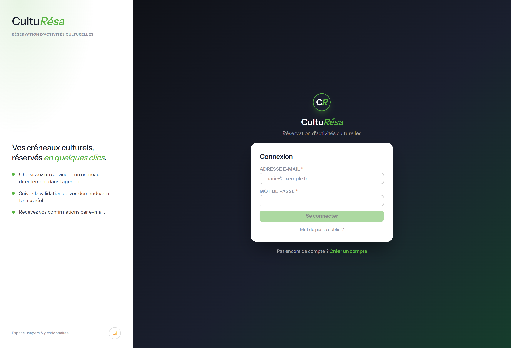

*Figure 1 — Page de connexion*

### Créer un compte

L'inscription se fait en renseignant votre identité (nom, prénom, e-mail, téléphone), puis en
choisissant votre **catégorie** (le demandeur : établissement ou organisme), votre **structure**
et votre **niveau**. Le nombre d'enfants et d'accompagnants est obligatoire : au moins 1 de
chaque (champs marqués d'un astérisque). L'acceptation de la politique de confidentialité (RGPD)
et la recopie d'un code de sécurité sont également demandées.

Un e-mail de vérification vous est ensuite envoyé pour **activer votre compte**.

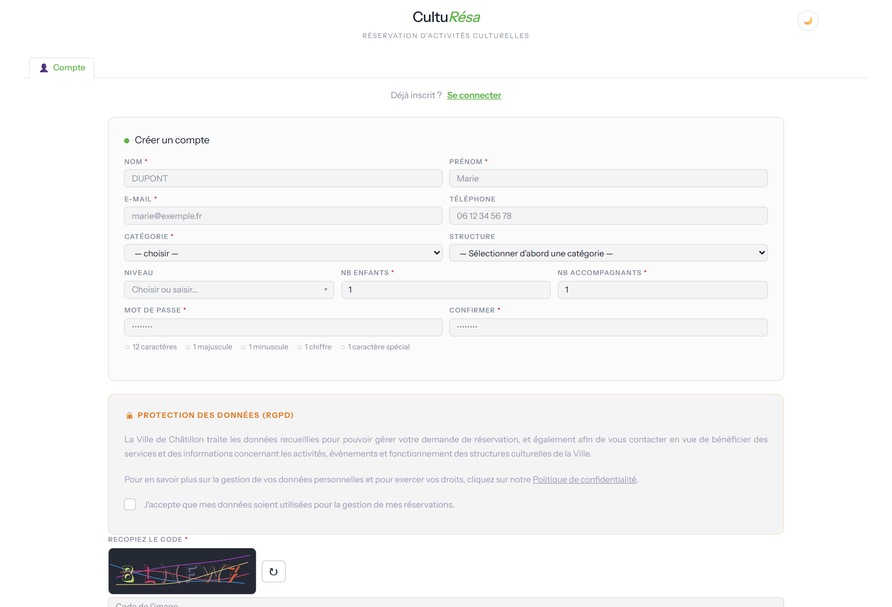

*Figure 2 — Formulaire de création de compte*

### Gérer son compte

Depuis **« Mon compte »**, vous pouvez modifier vos informations personnelles, changer votre mot
de passe et demander la suppression de votre compte :

- **Mon profil** — nom, prénom, e-mail, téléphone.
- **Changer mon mot de passe** — avec rappel des règles de sécurité (12 caractères, majuscule,
  minuscule, chiffre, caractère spécial).
- **Supprimer mon compte** — conformément au RGPD, vos données sont anonymisées de façon
  irréversible après un délai de grâce (e-mail de confirmation valable 24 h).

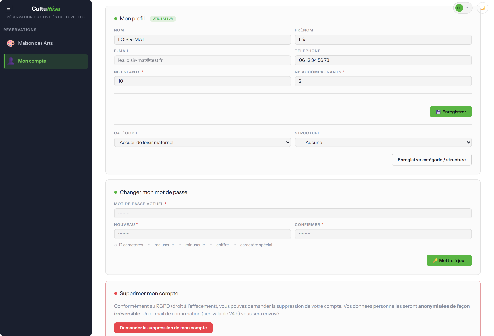

*Figure 3 — Écran « Mon compte »*

---

## 2. Pour les usagers — réserver une activité

### Première connexion

À la première connexion, une **fenêtre de bienvenue** présente l'essentiel pour démarrer. Vous
pouvez la parcourir avec **« Suivant »** ou la fermer avec **« Passer »**.

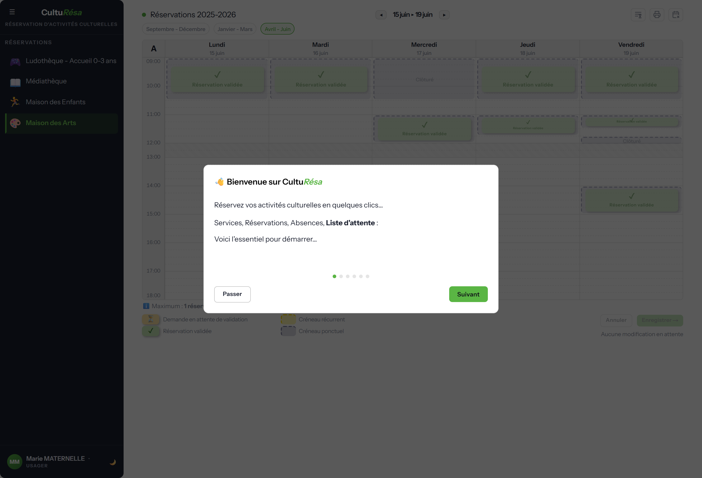

*Figure 4 — Fenêtre de bienvenue (première connexion)*

### L'agenda de réservation

Sélectionnez un service dans le **menu de gauche** pour ouvrir son agenda. La vue présente une
semaine type avec les créneaux disponibles.

- **Semaines A / B** — pour les activités en alternance, basculez entre la semaine A (semaines
  impaires) et la semaine B (semaines paires).
- **Période / exercice** — un bandeau indique l'année scolaire ou la période en cours.
- **Indicateurs** — chaque créneau affiche le nombre de places, son statut (en attente de
  validation, validée) et, le cas échéant, « Clôturé ».
- **Légende** — un rappel précise le nombre de séances réservables et les conditions du service
  (récurrent, semaines A/B, validation, thèmes, jauge, jours fériés, vacances scolaires).
- **Plus de place** — à votre arrivée sur l'agenda ou sur une période, si plus aucun créneau de
  la période affichée n'est réservable (tout est complet, clos ou hors délai), un message vous
  en informe et vous invite à contacter le service par e-mail (si le service a activé cette
  alerte).

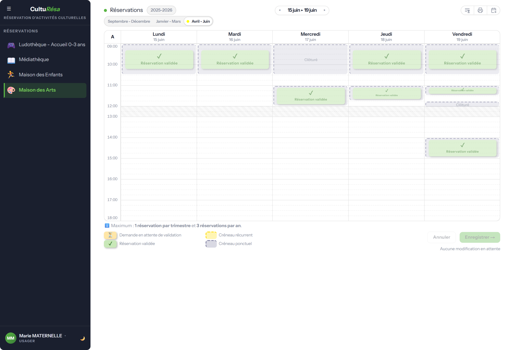

*Figure 5 — Agenda de réservation côté usager*

### Réserver, modifier, annuler

1. Cliquez sur un **créneau disponible** dans l'agenda.
2. Renseignez les informations demandées : éventuel **thème**, nombre d'**enfants** et
   d'**accompagnants**.
3. Cliquez sur **« Enregistrer »** pour confirmer. Un e-mail de confirmation vous est envoyé.

Vous pouvez **annuler** une réservation tant qu'elle n'est pas verrouillée. Si le service active
le **verrouillage des réservations validées**, une réservation validée ne peut plus être annulée
ni déplacée. Un bouton permet aussi d'**imprimer votre liste** de réservations.

### Prévenir d'une absence

Vous ne pourrez pas venir à **une séance** sans vouloir annuler toute votre réservation ? Si le
service a activé les **absences prévenues**, prévenez-le depuis l'agenda :

1. Affichez la **semaine de la séance** et repérez votre réservation.
2. Survolez son badge et cliquez sur le macaron **A** « Prévenir d'une absence », en haut à
   gauche du badge.
3. Indiquez si vous le souhaitez un **motif** (facultatif), puis confirmez.

Le service est **informé par e-mail** et le macaron passe en orange. Votre réservation est
**conservée** : seule la séance concernée est signalée. Si vous pouvez finalement venir, cliquez
de nouveau sur le macaron puis sur **« Retirer l'absence »**. Une absence se signale sur une
séance **à venir** (jour même inclus), tant qu'elle n'a pas été pointée par le service. Le bouton
**« Prévenir d'une absence »**, à droite des onglets de période, rappelle cette procédure.

### Liste d'attente

Tout est complet ? Si le service a activé la **liste d'attente**, le bouton **« Liste d'attente »**,
à droite des onglets de période, ouvre une fenêtre où vous indiquez vos **disponibilités par
demi-journée** (matin / après-midi, sur les jours d'ouverture du service). Vous serez **prévenu
par e-mail** dès que des créneaux correspondant à vos disponibilités se libéreront, dans l'ordre
d'inscription. Cochez **« M'inscrire automatiquement dès qu'un créneau se libère »** pour que la
réservation soit faite en votre nom, avec les participants de votre fiche : vous en êtes informé
par e-mail et retiré de la liste. Validez avec **« S'inscrire sur la liste d'attente »** ; une
fois inscrit, le même bouton permet de **mettre à jour** vos disponibilités ou de vous
**retirer de la liste**.

### Règles appliquées automatiquement

Lors d'une réservation, l'application vérifie automatiquement :

- la **capacité** du créneau (selon que les accompagnants comptent ou non dans la jauge) ;
- votre **droit d'accès** au service, selon votre demandeur ;
- le **nombre maximum de réservations** autorisé (par service et par période) ;
- les **jours de fermeture** : un créneau en période de vacances scolaires n'est réservable que
  si le service **et** le demandeur sont ouverts ce jour-là ;
- le **délai de réservation** : les créneaux trop proches dans le temps ne sont pas réservables.

### Rappels automatiques

Vous recevez des rappels par e-mail avant vos créneaux : un rappel **7 jours avant** (J-7) et un
rappel **la veille** (J-1).

---

## 3. Pour les gestionnaires de service

Les gestionnaires accèdent à un espace d'administration **limité aux services qui leur sont
confiés**. Chaque service dispose des onglets **Agenda**, **Éditions**, **Statistiques** et
**Paramètres**.

### Agenda — créneaux et réservations

L'agenda du gestionnaire permet de gérer les créneaux et les réservations de chaque usager.

- **Créer des créneaux** récurrents (jour, horaire, capacité, demandeurs autorisés) ou ponctuels
  (date précise).
- **Déplacer, copier ou supprimer** des créneaux.
- **Gérer les réservations** : ajouter, modifier, annuler ou valider une réservation pour un
  usager. L'e-mail de validation ou de remise en attente part après un court délai de
  regroupement (réglé par l'administrateur) : en cas d'hésitation, seul l'état final est notifié.
- **Pointage** : marquer chaque participant **Présent** ou **Absent** après la séance. En cas
  d'absence, un clic sur le macaron **A** du badge ouvre la fiche de la réservation pour saisir
  un **motif d'absence** (facultatif) — il apparaît ensuite dans l'infobulle du badge et sur la
  feuille de pointage des Éditions, et il est conservé si le pointage est effacé puis remis.
- **Absence prévenue** (si activée dans Paramètres › Configuration) : un usager peut signaler à
  l'avance, depuis son agenda, qu'il sera absent à une séance (les gestionnaires du service en
  sont informés par e-mail). Un
  gestionnaire prévenu par un autre canal l'enregistre lui-même dans la **fiche de la
  réservation** (case **« L'usager a prévenu le »** suivie de la date à laquelle il a prévenu,
  puis un motif facultatif, sur toute séance non encore pointée, même passée). La séance porte alors un macaron **A** orange et l'infobulle indique qui a prévenu
  et quand ; la réservation reste en place. En **mode pointage**, le premier clic sur une telle
  séance pose directement **Absent**.
- **Liste d'attente** (si activée dans Paramètres › Configuration) : le bouton **« Liste d'attente »**
  de la barre d'options, avec le nombre d'inscrits, ouvre la liste des usagers inscrits, dans l'ordre d'inscription,
  avec leurs disponibilités et leur choix d'inscription automatique ; un bouton permet de retirer
  une inscription. La tâche planifiée « Liste d'attente » prévient ou inscrit les usagers dès
  qu'un créneau réservable se libère.

> 💡 Cliquez sur un créneau vide pour ajouter une réservation, ou glissez une réservation
> vers un autre créneau pour la déplacer. Pour la déposer dans une **autre semaine**, survolez la
> flèche ◂ ou ▸, ou le **bord gauche ou droit** de la grille, pendant le glisser : l'agenda change
> de semaine, puis déposez la réservation. Survoler un **onglet de période** bascule de même sur
> cette période.

L'agenda affiche une **semaine datée** : créneaux récurrents et ponctuels, réservations et
pointages s'y gèrent au même endroit, semaine après semaine (flèches ◀ ▶ et onglets de période).

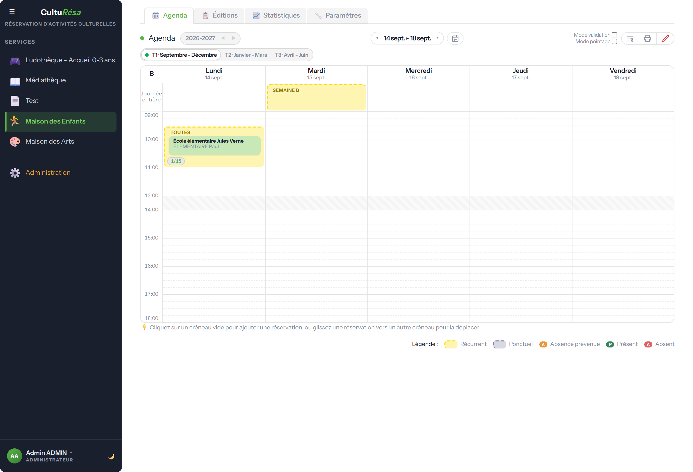

*Figure 6 — Agenda d'administration d'un service*

### Éditions — listes et suivi

L'onglet **Éditions** présente la **liste des inscrits** (les usagers ayant réservé sur
l'exercice — identité, structure, niveau, contact et date d'inscription ; tableau **triable par
clic sur les en-têtes de colonnes** ; les comptes anonymisés sont masqués par défaut), la
**liste des créneaux ouverts** (l'offre de réservation du service : jour, horaires, type,
période, places et demandeurs de chaque créneau, avec total et rupture par demandeur), le
tableau de **toutes les réservations** (période, date, créneau, demandeur, participant, thème,
nombre d'enfants, statut, pointage), une vue **Planning** hebdomadaire et la **feuille de
pointage** (avec les motifs d'absence ; une absence signalée à l'avance apparaît comme
« Absence prévenue », puis « Absent (prévenu) » une fois pointée). Chaque écran s'imprime en **PDF**, et les listes
(inscrits, créneaux ouverts, réservations) s'exportent en **CSV**.

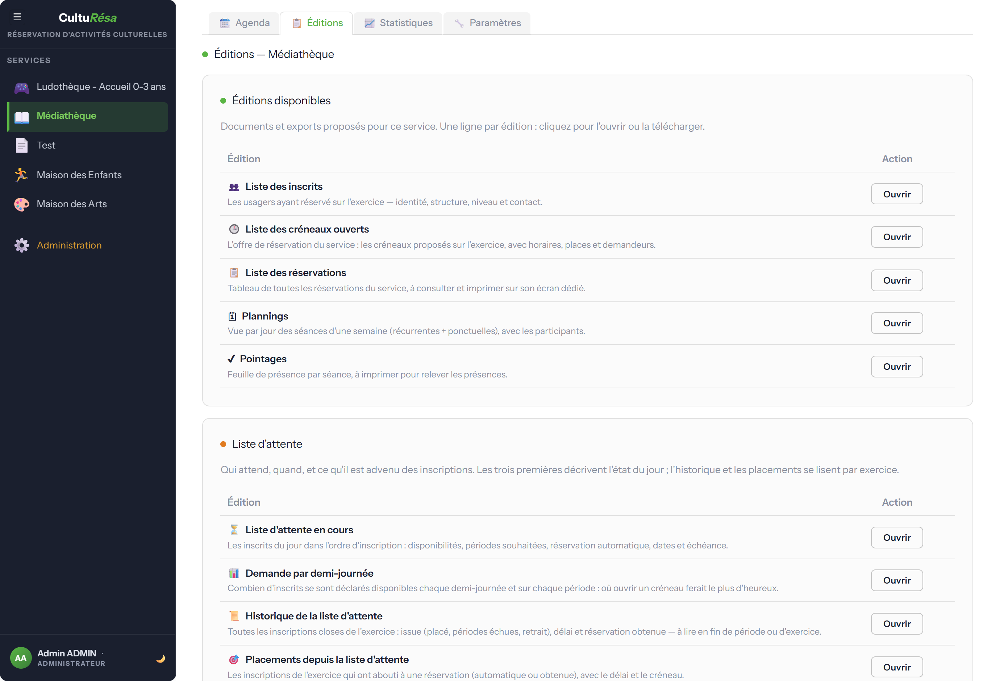

*Figure 7 — Liste des réservations (Éditions) et export CSV*

### Statistiques

Le tableau de bord du service présente des **compteurs** (réservations, usagers distincts, en
attente, enfants, accompagnants, absences prévenues), le **suivi de présence** sur les séances
passées (prévu / réalisé, taux de présence et de réalisation, absents prévenus ou non) et des
**graphiques** de répartition (par jour, par mois, par structure, par niveau, taux de
remplissage). Les données sont **filtrables et
exportables en CSV**.

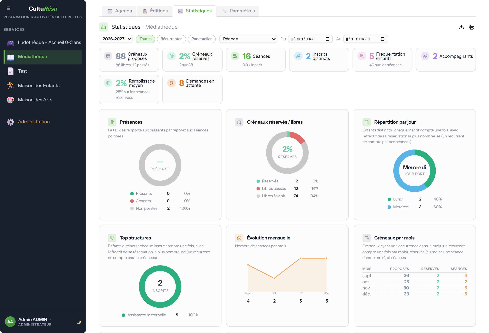

*Figure 8 — Statistiques d'un service*

### Paramètres — Périodes et réservations

Cet onglet regroupe les **périodes** (libellé, dates, couleur), les **jours d'ouverture**, les
**plages horaires** matin / après-midi, ainsi que les **règles de réservation** : maximums par
période et par an, délai de réservation, verrouillage de validation, validation automatique et
notifications aux gestionnaires.

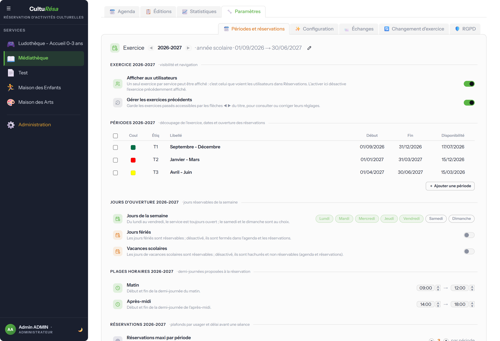

*Figure 9 — Paramètres : périodes et réservations*

#### Exercices et bascule « Affiché aux utilisateurs »

Un **exercice** représente une saison / année scolaire ; il regroupe ses propres périodes, jours
d'ouverture, plages horaires et règles de réservation. Un service peut détenir **plusieurs
exercices en parallèle**, mais **un seul est montré aux utilisateurs à la fois** : celui dont la
case **« Affiché aux utilisateurs »** est cochée (en haut du panneau, à côté de la navigation entre
exercices). Cocher un exercice **décoche automatiquement** le précédent ; si aucun n'est coché, le
service n'affiche **aucune réservation** côté usager.

Cela permet de **préparer le prochain exercice longtemps à l'avance** :

1. Le gestionnaire **crée le nouvel exercice** (via « Changement d'exercice », ou en l'ajoutant
   manuellement) et le **paramètre tranquillement** — périodes, créneaux, ouvertures, maximums.
   Tant que sa case n'est pas cochée, ce nouvel exercice reste **invisible** pour les usagers.
2. **Pendant toute cette préparation**, les utilisateurs continuent de **consulter et réserver sur
   l'exercice précédent**, qui garde sa case cochée. Les deux exercices peuvent coexister, même si
   leurs dates se chevauchent.
3. **Quand le gestionnaire est prêt** — le plus souvent une fois l'exercice précédent achevé et le
   nouveau entièrement paramétré — il **bascule** en cochant « Affiché aux utilisateurs » sur le
   nouvel exercice, dans **Paramètres → Périodes et réservations**. À cet instant, et à cet instant
   seulement, les usagers voient le nouvel exercice.

> La bascule n'impose aucune condition : elle peut se faire à tout moment (rien n'oblige à attendre
> la fin de l'exercice précédent). L'assistant **« Changement d'exercice »** automatise la création
> du nouvel exercice (reconduction des périodes et créneaux avec dates décalées) et lui transfère
> ce drapeau ; la case reste modifiable à la main ensuite.

### Paramètres — Configuration (accès et thèmes)

La configuration définit les **paramètres globaux** du service — **créneaux récurrents** (autorise
les créneaux qui se répètent chaque semaine), **alternance Semaine A/B** (sans effet si les créneaux
récurrents sont désactivés), **prise en compte des accompagnants** dans la jauge, **absences
prévenues** (l'usager peut signaler depuis son agenda qu'il sera absent à une séance, le
gestionnaire l'enregistrer dans la fiche de réservation ; désactivé par défaut), **liste
d'attente** (l'usager dépose ses disponibilités par demi-journée et est prévenu par e-mail, ou
inscrit automatiquement, dès qu'un créneau se libère ; désactivé par défaut) et **alerte
« plus de place »** (à l'arrivée sur l'agenda ou sur une période, si plus aucun créneau de la
période affichée n'est réservable, une fenêtre informe l'usager et l'invite à contacter le
service via l'e-mail de contact du référentiel Services ; le texte du message est
personnalisable) — puis, **pour chaque demandeur**, la
**validation** et les **thèmes**. Le
mode des thèmes peut être **« libre »** (texte saisi par l'usager) ou **« liste »** (choix
imposé).

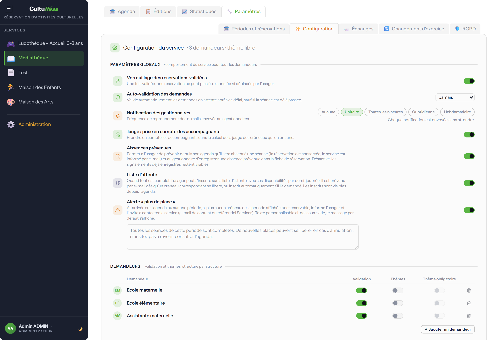

*Figure 10 — Paramètres : configuration des accès par demandeur*

### Paramètres — Échanges (e-mails du service)

Chaque service peut personnaliser le **contenu** de ses e-mails de réservation : réservation
confirmée, demande enregistrée, réservation annulée, réservation non validée (refus), rappel de
réservation, absence prévenue et liste d'attente (inscription, créneaux libérés, inscription
automatique). Le bouton **« Modifier »** personnalise le contenu ; à défaut, le gabarit global est
utilisé. Le **routage, le destinataire et l'activation de l'envoi** sont, eux, **globaux** (voir
[Administration → Échanges](#échanges-e-mails-réglages-globaux)).

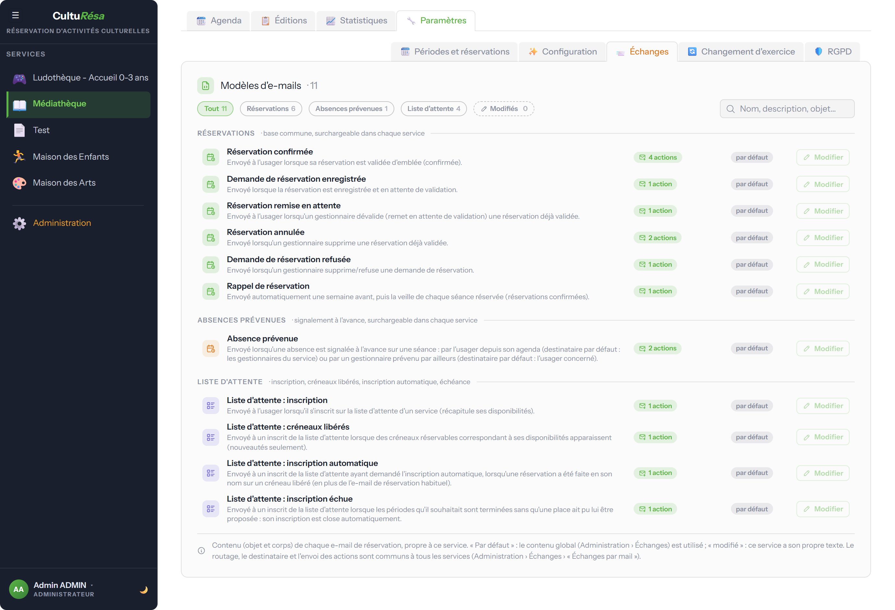

*Figure 11 — Paramètres : e-mails personnalisés par service*

### Paramètres — Changement d'exercice

Bascule le service vers un **nouvel exercice** (nouvelle saison / année scolaire) : les périodes
du nouvel exercice sont créées avec des **dates décalées** à partir de l'exercice précédent ; les
exercices antérieurs restent consultables.

### Paramètres — RGPD (usagers du service)

Vue RGPD **limitée aux usagers rattachés au service** : repérer les comptes inactifs concernés.
Le pilotage RGPD global (avis de suppression, anonymisation, journal d'audit) reste dans
[Administration → RGPD](#rgpd-et-conservation-des-données).

---

## 4. Pour les administrateurs

Les administrateurs disposent de **toutes les fonctions des gestionnaires**, sur l'ensemble des
services, ainsi que de la **gestion globale** de l'application via l'onglet **« Administration »**.

### Configuration et référentiels

La page **Configuration** regroupe les réglages de l'application (zone des vacances scolaires,
URL, intervalles de rafraîchissement automatique, mode debug) et l'accès aux **référentiels** :
**Services**, **Demandeurs**, **Structures** et **Niveaux**. Le référentiel des services porte,
en plus du nom et de l'icône, un **e-mail de contact** générique (ex.
`maisondesarts@chatillon92.fr`) proposé aux usagers quand plus aucune place n'est disponible.

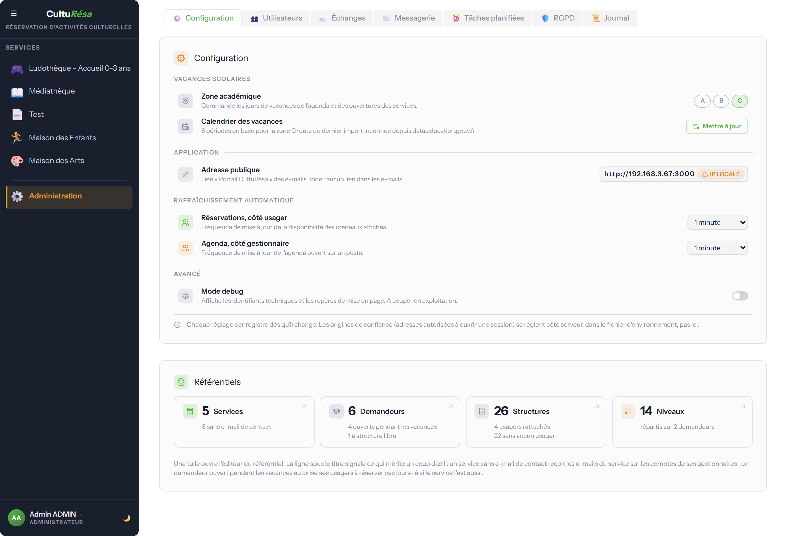

*Figure 12 — Configuration générale et référentiels*

### Utilisateurs

La liste des utilisateurs permet de rechercher, filtrer et modifier les comptes : informations,
**rôle** (utilisateur, gestionnaire, administrateur), structure / service rattaché, services
gérés et statut RGPD.

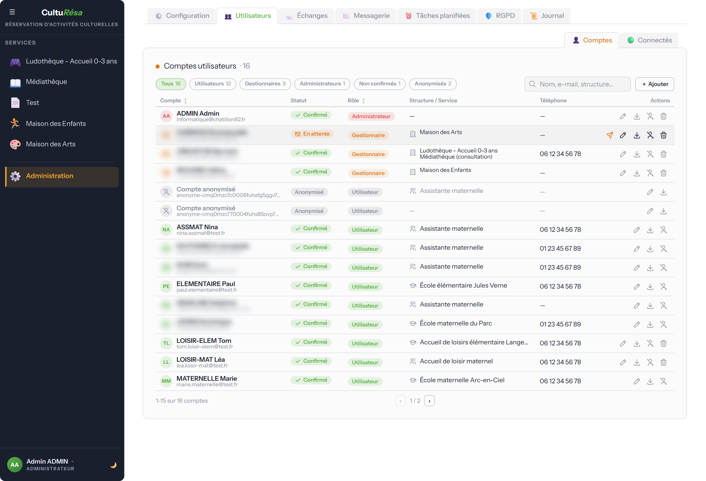

*Figure 13 — Gestion des comptes utilisateurs*

### Échanges — e-mails (réglages globaux)

L'onglet **Échanges** règle les e-mails **au niveau global** (communs à tous les services), en
deux volets :

- **Échanges par mail** — pour chaque action, le **type d'e-mail** envoyé, son **destinataire** et
  l'**activation de l'envoi**. En dessous, le **délai de regroupement des notifications de
  validation** (5 minutes par défaut) : quand un gestionnaire valide ou remet en attente une
  réservation, l'e-mail part après ce délai et ne reflète que l'**état final** — une hésitation
  (validé, dévalidé, validé…) ne produit qu'un e-mail au plus, ou aucun si l'état revient à
  celui que l'usager connaissait. 0 = envoi immédiat à chaque clic.
- **Modèles d'e-mails** — l'**objet et le corps** de tous les types. Les e-mails de réservation
  servent de **base surchargeable par chaque service** (onglet Échanges du service) ; les e-mails
  **système** (compte, sécurité, test) sont toujours envoyés. On peut aussi créer des **types
  personnalisés globaux**.

### Messagerie

L'onglet **Messagerie** configure l'envoi des e-mails (paramètres SMTP), gère les **e-mails
système** (vérification de compte, réinitialisation de mot de passe, etc.) et permet de
**relancer les envois en échec**.

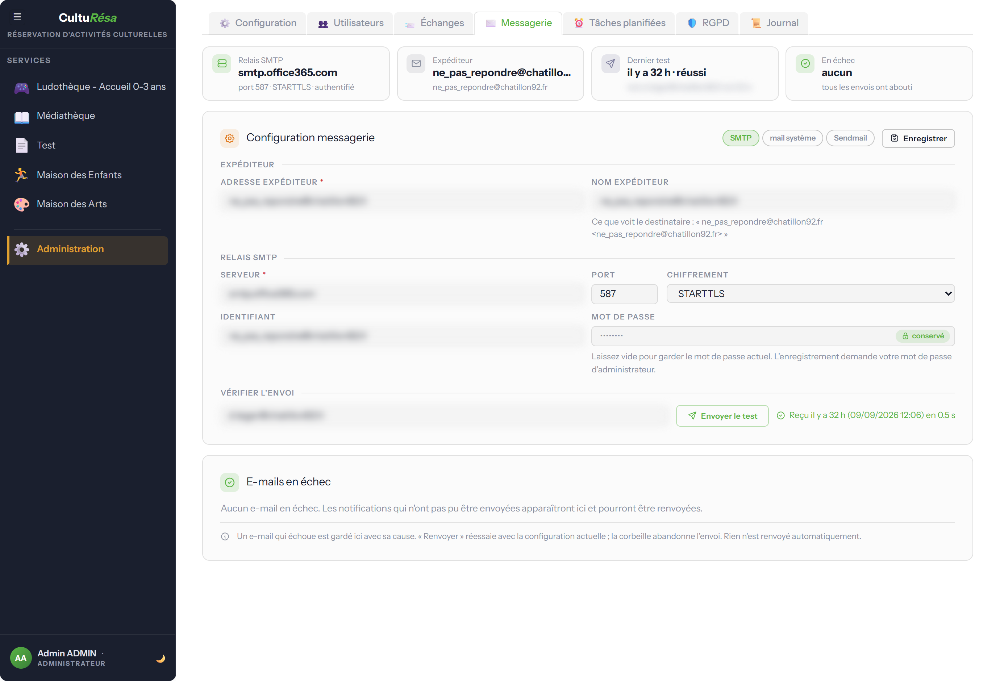

*Figure 14 — Configuration de la messagerie*

### RGPD et conservation des données

L'onglet **RGPD** permet de repérer les **comptes inactifs**, de déclencher un **avis de
suppression** (délai de grâce de 30 jours), d'**anonymiser** des comptes et de consulter le
**journal d'audit** (historique immuable des actions liées aux données personnelles).

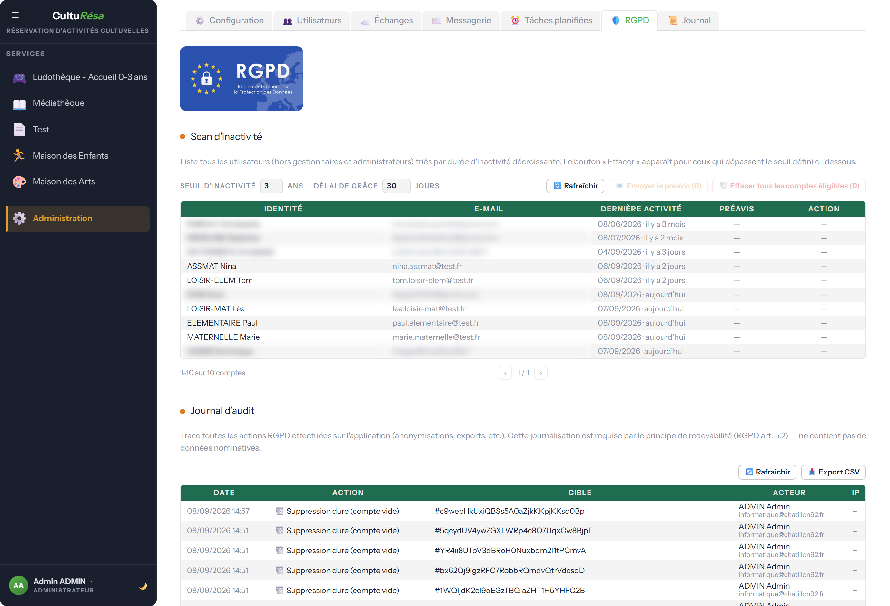

*Figure 15 — RGPD : conservation des données et journal d'audit*

---

## 5. Notions clés

- **Demandeur** — l'établissement ou l'organisme auquel un usager est rattaché. Il conditionne
  l'accès aux services et les jours d'ouverture.
- **Structure** — unité organisationnelle sous un demandeur ; rattacher un usager à une structure
  lui fait hériter du demandeur.
- **Niveau** — classification (par demandeur) utilisée dans le profil et les statistiques.
- **Service** — une activité culturelle, avec ses propres créneaux, périodes, règles et e-mails.
- **Période / Exercice** — une période est une plage de dates (saison, semestre) ; l'exercice
  correspond à l'année (ex. « 2025-2026 »).
- **Créneau** — un créneau récurrent se répète chaque semaine ; un créneau ponctuel correspond à
  une date précise (un créneau = un jour).
- **Semaines A / B** — alternance pour les activités bi-hebdomadaires : semaine impaire = A,
  semaine paire = B.
- **Validation / verrouillage** — une réservation validée peut être verrouillée (selon le réglage
  du service), empêchant toute annulation ou déplacement côté usager.
- **Pointage / absence prévenue** — le pointage constate la présence ou l'absence **après** la
  séance ; l'absence prévenue est un signalement **à l'avance** (usager ou gestionnaire) qui
  n'annule pas la réservation et pré-remplit le pointage « Absent ».
- **Jauge** — la capacité d'un créneau ; selon le service, les accompagnants y sont comptés ou non.
- **Vacances scolaires** — récupérées depuis le calendrier officiel selon la zone ; un jour de
  vacances n'est réservable que si le service et le demandeur sont ouverts.

---

## 6. Automatismes en arrière-plan

Plusieurs traitements s'exécutent automatiquement, sans intervention :

- **Validation automatique** des réservations après un délai paramétré, avec récapitulatif envoyé
  aux gestionnaires.
- **Rappels de réservation** envoyés aux usagers (J-7 et J-1).
- **Notifications de validation** regroupées : l'e-mail de validation ou de remise en attente part
  après le délai réglé dans Échanges et ne reflète que l'état final.
- **Liste d'attente** : toutes les 5 minutes, pour chaque inscrit et dans l'ordre d'inscription,
  recherche des créneaux réservables correspondant à ses disponibilités — inscription automatique
  si demandée, sinon e-mail « créneaux libérés » (nouveautés seulement).
- **Conservation des données** : anonymisation des comptes inactifs après l'avis de suppression.

---

## Voir aussi

- [Guide d'administration](Guide-administration.md) — installation serveur, base de données,
  sauvegardes.
- [Exploitation](EXPLOITATION.md) — runbook d'exploitation au quotidien.
- Présentation interactive intégrée à l'application (menu utilisateur → **« Revoir la
  présentation »**).
